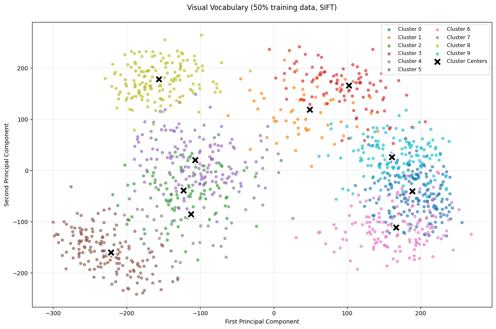
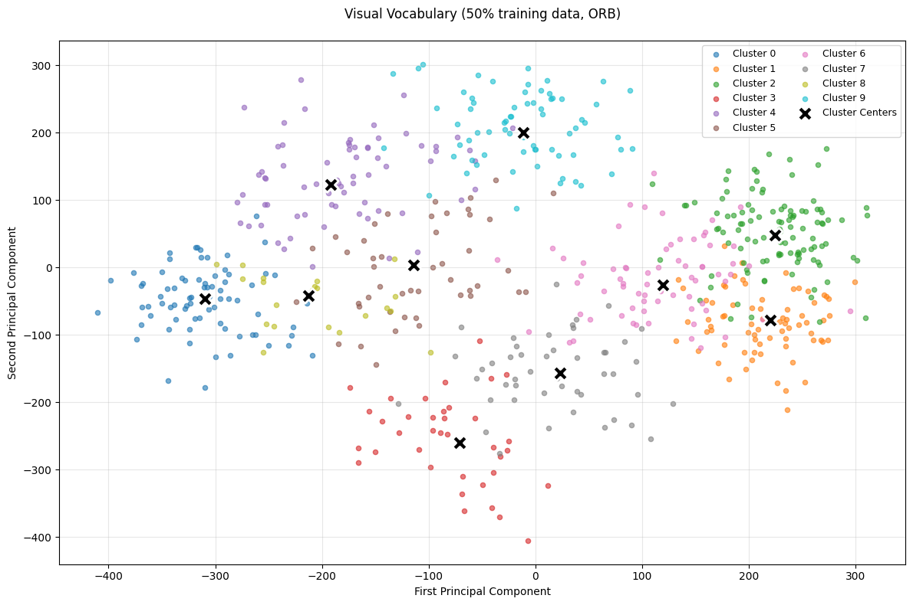
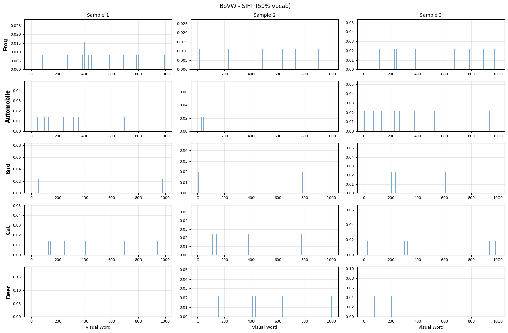
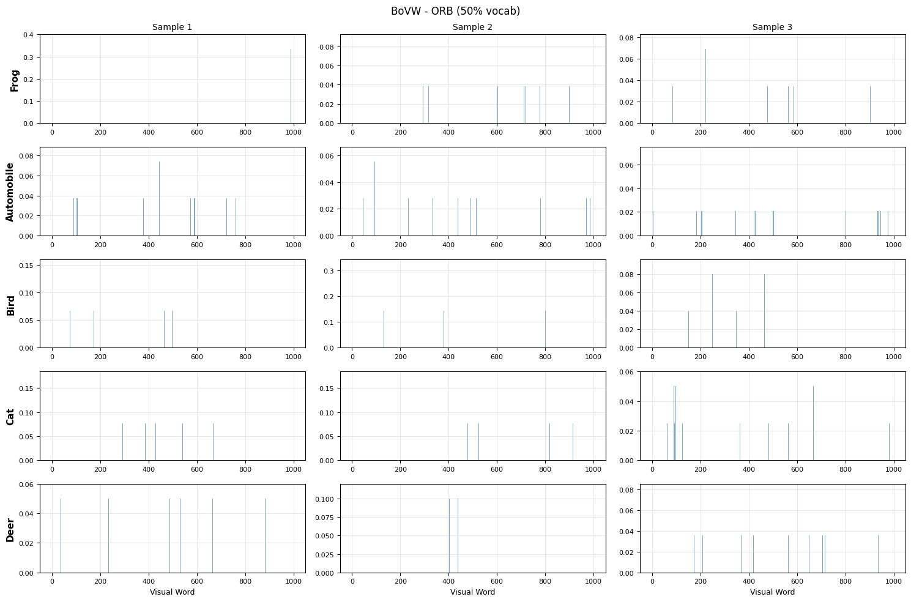
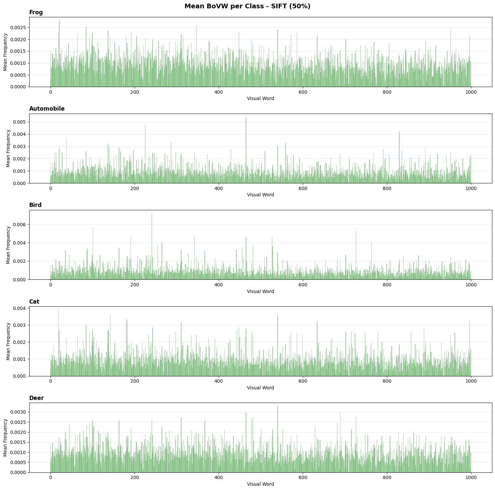
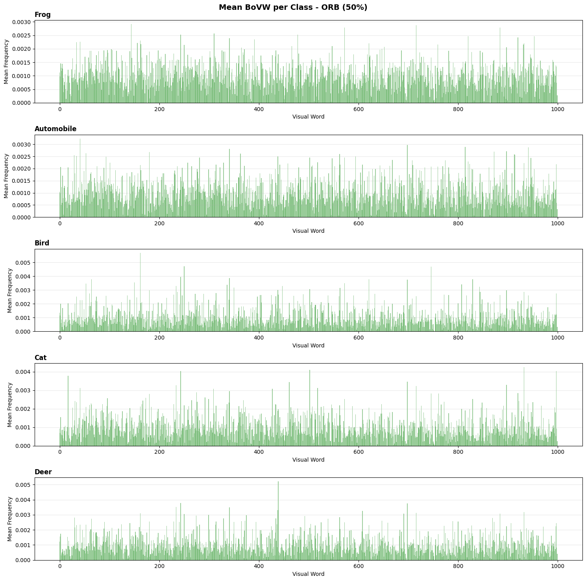
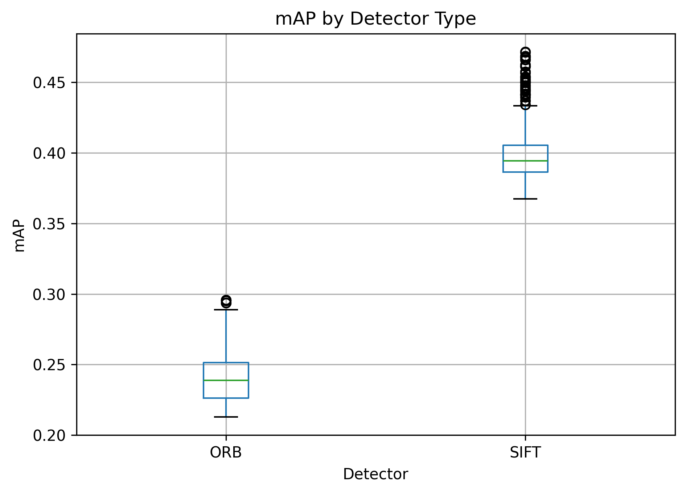
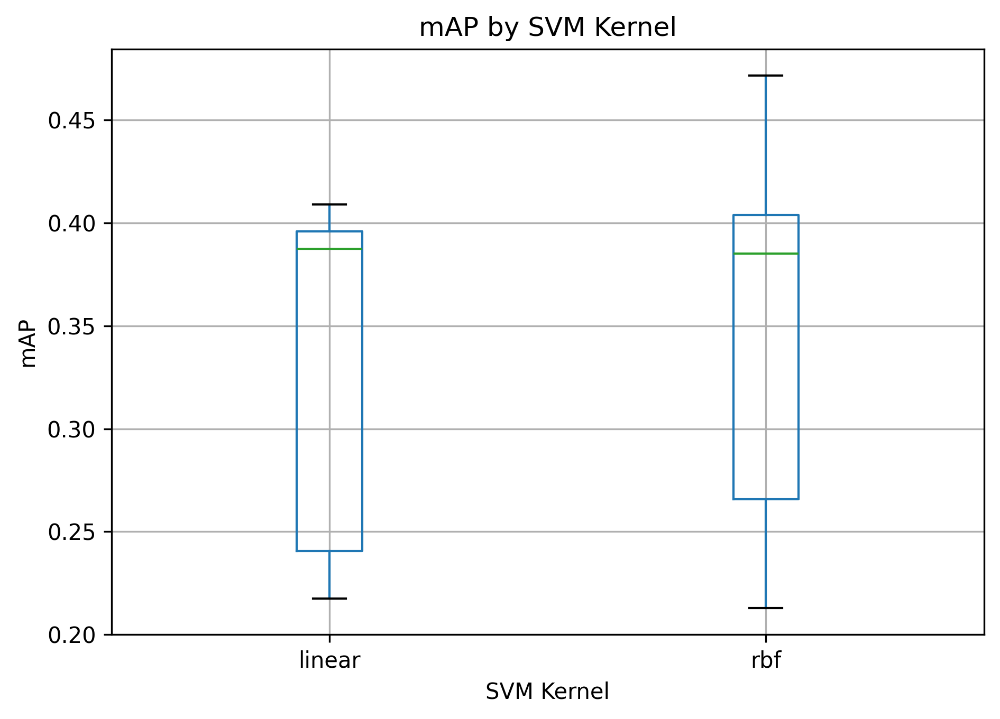

# Bag of Visual Words for Image Classification

_Computer Vision 1 – Final Lab (Part I)_  
**University of Amsterdam, Informatics Institute**  
**Authors:** Isabelle Mudadalam (15494349), Niccolò Caselli (16391888), Marthe Schnieders (12749958)

---

## 🧠 Abstract

This project implements and evaluates a **Bag of Visual Words (BoVW)** image classification pipeline on five CIFAR-10 classes: _frog, automobile, bird, cat, and deer_.  
Through extensive hyperparameter search, we compare **SIFT** and **ORB** feature detectors combined with **K-Means clustering** and **SVM classification**.

- SIFT achieved a **maximum mAP of 0.47**
- ORB achieved **mAP of 0.29**

The best configuration uses **SIFT (500 features)**, **1,500 visual words**, and an **RBF kernel SVM**.

---

## 📚 Methodology

### 1. Dataset

Subset of **CIFAR-10**, resized to 32×32 pixels and limited to five categories.

### 2. Feature Extraction

Two detectors were compared:

- **SIFT** (Scale-Invariant Feature Transform)
- **ORB** (Oriented FAST and Rotated BRIEF)

| Class      | SIFT keypoints | ORB keypoints |
| ---------- | -------------- | ------------- |
| Frog       | 67.82 ± 28.49  | 36.17 ± 24.76 |
| Automobile | 56.25 ± 22.58  | 34.90 ± 19.50 |
| Bird       | 39.22 ± 20.57  | 18.32 ± 14.71 |
| Cat        | 43.57 ± 22.87  | 22.22 ± 19.33 |
| Deer       | 43.87 ± 21.62  | 21.37 ± 16.60 |

---

## 🧩 Visual Vocabulary Construction

A **MiniBatchKMeans** algorithm built vocabularies with 1000 clusters (visual words).  
Three dataset proportions were tested: 30%, 40%, 50%.

  
  

---

## 📊 Feature Representation

Images were encoded as histograms of visual word frequencies.

  
  

Average histograms per class:

  
  

---

## ⚙️ Hyperparameter Search

A total of **1,296 configurations** were tested varying:

- Detector type, number of features, and upscale factor
- Vocabulary size and training subset size
- SVM kernel, C, and γ parameters

  
  

Best configuration:

- **Detector:** SIFT
- **#Features:** 500
- **Visual words:** 1500
- **Subset:** 30%
- **Kernel:** RBF
- **C:** 1.0
- **γ:** scale
- **mAP:** 0.4716

---

## 🏁 Conclusion

- **SIFT** provides superior and more stable features than **ORB**, which struggled at small scales.
- The BoVW framework achieved **mAP ≈ 0.47**, demonstrating the limitations of hand-crafted features.
- Future work: replace BoVW with **deep visual embeddings (e.g., CLIP or Vision Transformers)** to improve representation power.
